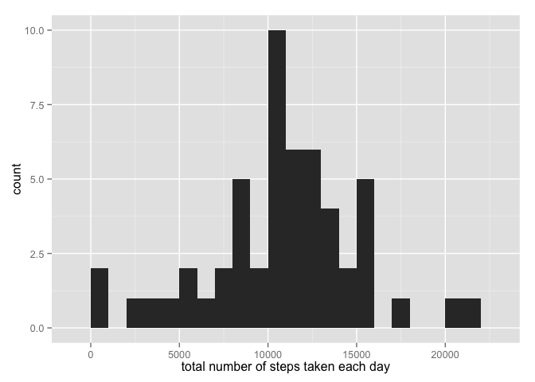
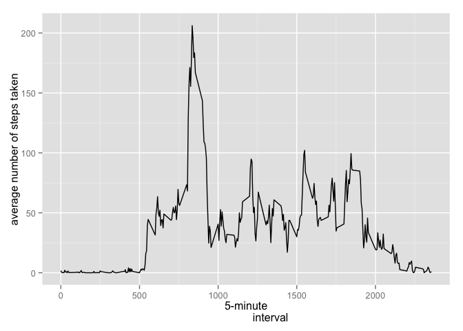
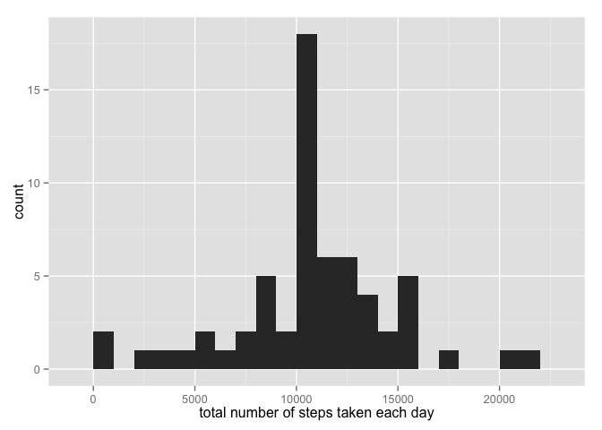
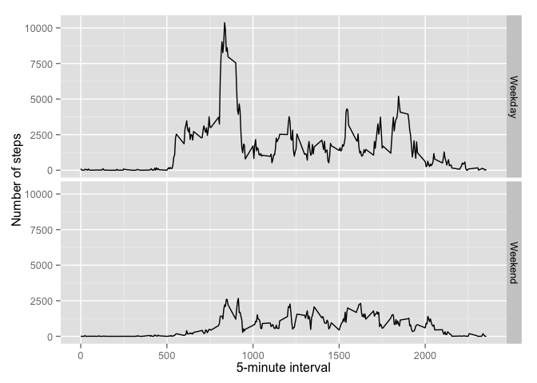

# Reproducible Research: Peer Assessment 1

## Loading and preprocessing the data

Task: Show any code that is needed to load the data


```r
unzip(zipfile = "activity.zip")
data = read.csv("activity.csv", header = TRUE)
```


## What is mean total number of steps taken per day?

Task: Calculate the total number of steps taken per day. Make a histogram of the total number of steps taken each day


```r
library(ggplot2)
tspd <- aggregate(steps ~ date, data, sum, na.rm = TRUE)
plot1 <- qplot(steps, data = tspd, binwidth = 1000, 
               xlab = "total number of steps taken each day")
plot1
```

 


Task: Calculate and report the mean and median of the total number of steps taken per day


```r
mean <- mean(tspd$steps, na.rm = TRUE)
median <- median(tspd$steps, na.rm = TRUE)
mean
```

```
## [1] 10766.19
```

```r
median
```

```
## [1] 10765
```


## What is the average daily activity pattern?

Task: Make a time series plot (i.e. type = "l") of the 5-minute interval (x-axis) and the average number of steps taken, averaged across all days (y-axis)


```r
library(ggplot2)
fiveda <- aggregate(x = list(steps = data$steps), by = list(interval = data$interval), 
                    FUN = mean, na.rm = TRUE)
fiveda$interval <- as.numeric(fiveda$interval)
plot2 <- ggplot(data = fiveda, aes(x = interval, y = steps)) + geom_line() + xlab("5-minute
                interval") + ylab("average number of steps taken")
plot2
```

 

Task: Which 5-minute interval, on average across all the days in the dataset, contains the maximum number of steps?


```r
fiveda.max <- fiveda[which.max(fiveda$steps), ]
fiveda.max
```

```
##     interval    steps
## 104      835 206.1698
```

## Imputing missing values

Task: Calculate and report the total number of missing values in the dataset.


```r
missing <- sum(is.na(data$steps))
missing
```

```
## [1] 2304
```

Task: Create a new dataset that is equal to the original dataset but with the missing data filled in.


```r
fill.value <- function(steps, interval) {
    filled <- NA
    if (!is.na(steps)) 
        filled <- c(steps) else filled <- (fiveda[fiveda$interval == interval, "steps"])
    return(filled)
}
data.filled <- data
data.filled$steps <- mapply(fill.value, data.filled$steps, data.filled$interval)

missing.filled <- sum(is.na(data.filled$steps)) #Check the result
missing.filled
```

```
## [1] 0
```

Task: Make a histogram of the total number of steps taken each day and Calculate and report the mean and median total number of steps taken per day. 


```r
total.steps <- aggregate(steps ~ date, data.filled, sum, na.rm = TRUE)
plot3 <- qplot(steps, data = total.steps, binwidth = 1000, 
               xlab = "total number of steps taken each day")
plot3
```

 

Task: Do these values differ from the estimates from the first part of the assignment? What is the impact of imputing missing data on the estimates of the total daily number of steps?


```r
mean2 <- mean(total.steps$steps)
median2 <- median(total.steps$steps)
mean2
```

```
## [1] 10766.19
```

```r
median2
```

```
## [1] 10766.19
```

The mean and the median approximated, because the missing values were replaced. Without the missing values the two values were equal.

## Are there differences in activity patterns between weekdays and weekends?


Task: Create a new factor variable in the dataset with two levels – “weekday” and “weekend” indicating whether a given date is a weekday or weekend day.


```r
data.filled.wd <- data.filled
data.filled.wd$date <- as.Date(data.filled.wd$date)
data.filled.wd$weekday <- weekdays(data.filled.wd$date)
data.filled.wd$daytype <- ifelse(data.filled.wd$weekday %in% 
                                     c("Samstag", "Sonntag"),"Weekend", "Weekday")  
# Sorry, for the german version
```


Task: Make a panel plot containing a time series plot (i.e. type = "l") of the 5-minute interval (x-axis) and the average number of steps taken, averaged across all weekday days or weekend days (y-axis). 


```r
averages <- aggregate(steps ~ interval + daytype, data = data.filled.wd, sum)

plot4 <- ggplot(averages, aes(interval, steps)) + geom_line() + facet_grid(daytype ~ .) + 
    xlab("5-minute interval") + ylab("Number of steps")
plot4
```

 


